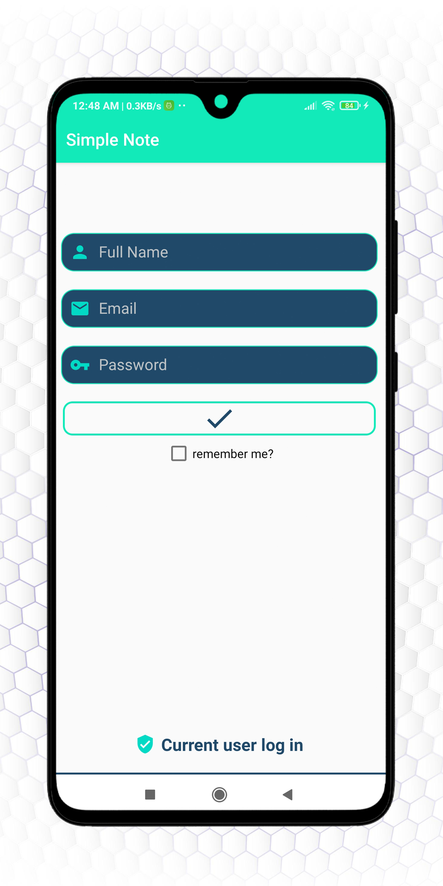
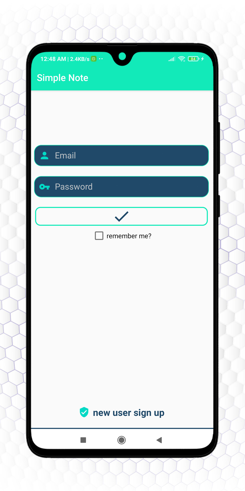
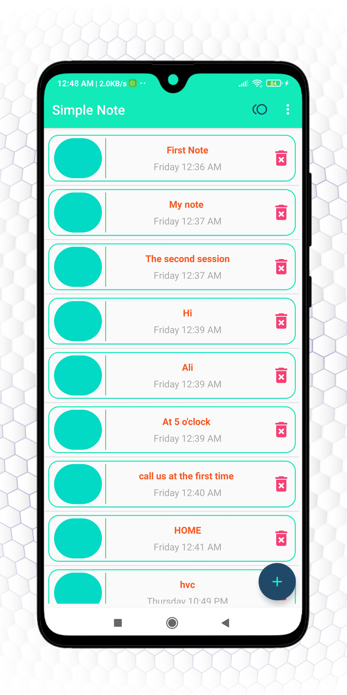
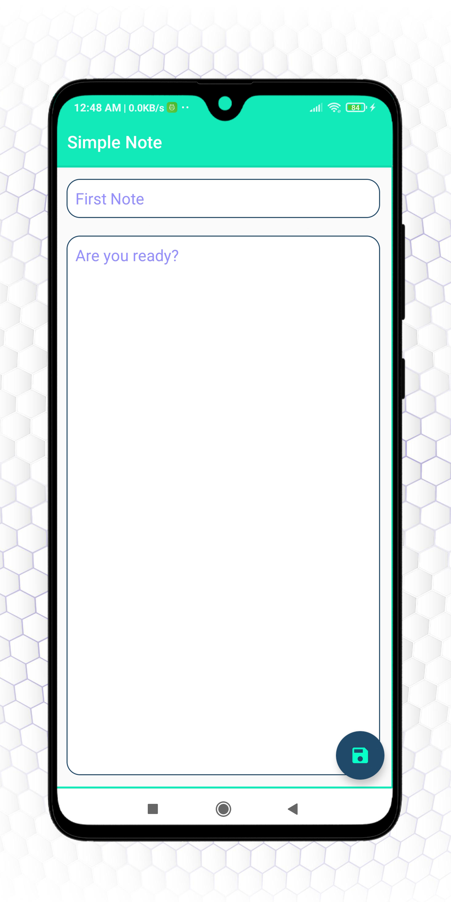
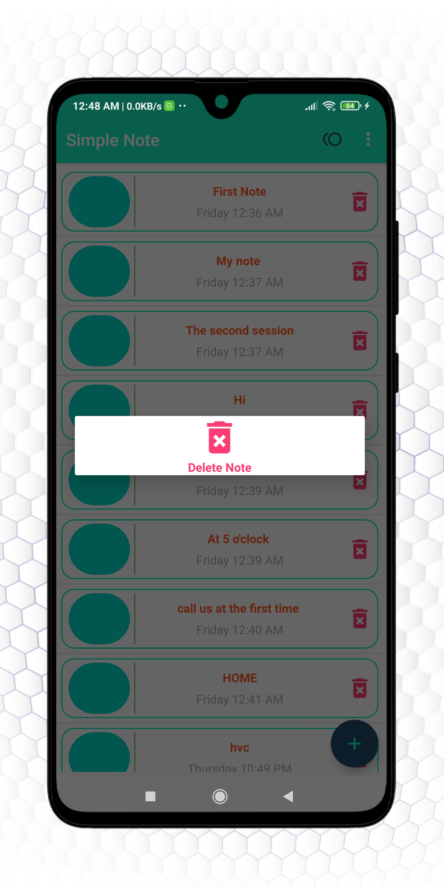
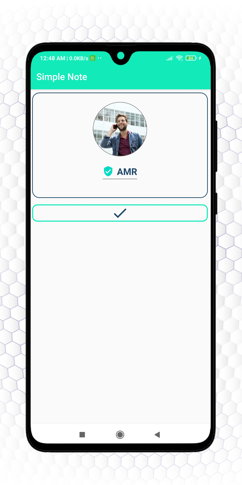
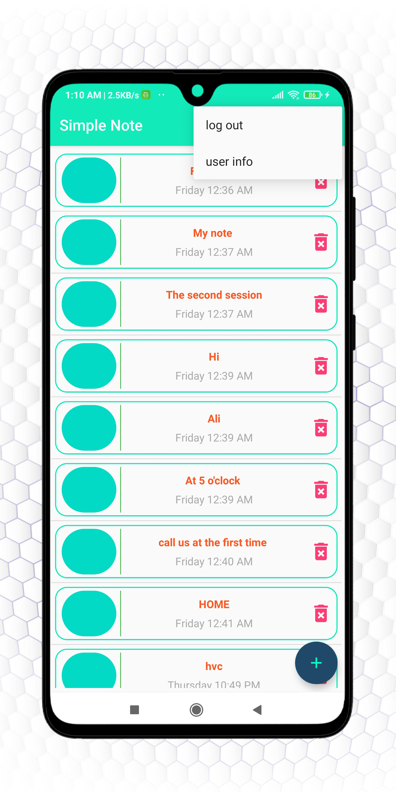

# Simple Note

## Simple Note  is a native android application for storing simple notes using firebase

---

<table style="width:100%" >
  
  <tr> 
   <th>   <h2>SignUp Screen</h2>   </th> 
  <tr/>
  <tr>
    <th></th>
  </tr>
  

  <tr>  
   <th>   <h2>Login Screen</h2> </th>
  <tr/>
  <tr>
   <th></th>
  </tr>
  
  
  <tr>  
   <th>   <h2>Home Screen</h2> </th>
  <tr/>
  <tr>
   <th></th>
  </tr>
  
  
  <tr>  
   <th>   <h2>AddEdit note Screen</h2> </th>
  <tr/>
  <tr>
   <th></th>
  </tr>
  
    
  <tr>  
   <th>   <h2>Delete note</h2> </th>
  <tr/>
  <tr>
   <th></th>
  </tr>
  
 
  <tr>  
   <th>   <h2>Profile Screen</h2> </th>
  <tr/>
  <tr>
   <th></th>
  </tr>
  
   
   
  <tr>  
   <th>   <h2>Menu</h2> </th>
  <tr/>
  <tr>
   <th></th>
  </tr>

  
</table>

---
## Social Links 

 
 
  
   
  

---
